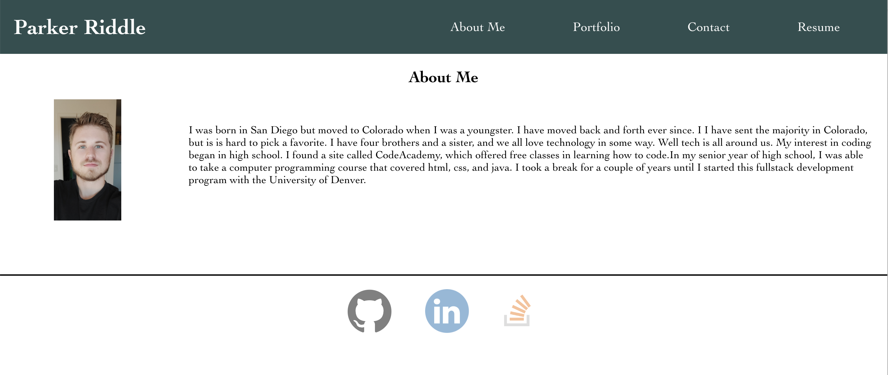

# Portfolio-Using-React

I have been tasked with creating a page to display my future portfolio. The example provided helped me with the layout of the page. I originally wanted to create a page that incorporated a grid layout to showcase my work. It worked great up until I got to re-sizing the css for the width of the page. I ended up switching to flex instead.

[Link to my webpage](https://priddle88.github.io/Portfolio-Using-React/)

## The Process

The main objective fo rme was to organize the different layers and pages using the components folder. I used css as well to style and layout the page so I can organize everything where I wanted them to go.
  
## Header Image

The left side of my header looked cluttered to me so I placed it on the left of the page. But when I would make thescreen smaller, the image would collide with my name. As the screen width got even smaller, I placed the image belowmy name and gave my name the full width of the page.

## Nav Bar

I wrote the html for the navigation bar without the css and ran the code to see what the default would look like.All three list items were there but they were displayed vertically. I wanted to switch them to be horizontal so Idisplayed them as inline instead.When scaling, the nav bar did need to be resized when the text ran out of room. Idecided to switch the links back to being vertical and added a border for a more aesthetic look. I also made sure toadd links to the sections of the page below.

## About Me

Added inline css to make the text horizontal then back to vertical to scale. Added border on left to sepereate textand title which switches to above for smaller screen sizes.

## Portfolio

I originally planned to design the layout of this section with a grid format. I had everything written out and theplaceholder images looked great. I wanted to add a hover affect to the images and I also wanted to make the firstimage to be larger than the rest. I realized that I could do that with the grid but it would take more code than ifI were to use flex. I decided to make the switch. I wrapped the content and made the first image have a bigger widththan the rest. I used relative positioning to place the title where I wanted to on the images. When scaling down,flex did most of the work. I used percentages with with width so that scaling would be easier. Eventually the widthbecame so small that the images would no longer fit, so I hid the images and kept the clickable titles to link to mywork.

## Contact Page

I used the site [formsubmit.co](https://formsubmit.co/) to help me send an email to my email when someone wants to contact me. They made the process super simple compared to the other methods I tried. 

## Contact Info

I centered the header ("Contact Info") and seperated the html below with a div tag. I did the same as before to switch from vertical to horizontal (inline) and back (block).

## Questions

Reach out to parkerriddle09@gmail.com if you have any questions